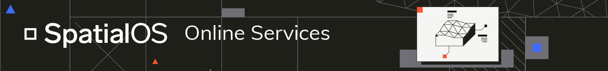

# SpatialOS Online Services

 

**About SpatialOS** 
[SpatialOS](https://docs.improbable.io) is a platform-as-a-service from [Improbable](https://www.improbable.io/); it provides managed cloud services that solve common technical and production challenges of creating, iterating on, and hosting multiplayer games. It runs games in a way that lets them scale further, be more complex, and have long-living persistence.

**About Online Services** 
SpatialOS Online Services provide infrastructure around your game's SpatialOS cloud deployment.

This repository provides a suite of example gRPC (with additional HTTP support) services, packages and images. It gives you everything you need to start building online services to support your game on SpatialOS; authentication, matchmaking, analytics, or anything else you can think of.

Online Services are as unopinionated and generic as possible because you know best what your game requires. The primary language is C#, but we provide protocol buffer files too so you should be able to re-implement the services in whichever language you choose. The services support gRPC and HTTP.

We encourage you to create a fork of this repository so that you can make whatever customizations you want to it; use it as a base, rather than a comprehensive one-size-fits-all solution.

## Documentation

You can find the documentation at [docs.improbable.io](https://docs.improbable.io/metagame).

## Included in this repository

Trying to find something quickly? Below is a list of services, packages and sample configuration files included in this repository.

### Services

A selection of deployable services for authentication, matchmaking or other functionality.

#### Gateway

The client-facing interface to the matchmaking system. Exposes two gRPC services: the Gateway service and a [Long-running Operations](https://github.com/googleapis/googleapis/blob/master/google/longrunning/operations.proto) service.

- [C# service](./services/csharp/Gateway)
- [Gateway proto definition](./services/proto/gateway/gateway.proto)
- [Long-running Operations proto definition](./services/proto/google/longrunning/operations.proto)

#### GatewayInternal

The matcher-facing interface to the matchmaking service. Exposes a GatewayInternal gRPC service - with the default configuration this is only exposed to other services on the Kubernetes cluster.

- [C# service](./services/csharp/GatewayInternal)
- [Proto definition](./services/proto/gateway/gateway_internal.proto)

#### Party and invite

A separate, but related, service to the matchmaking system. Provides operations for the management of parties and invites to those parties. Exposes Party and Invite gRPC services.

- [C# service](./services/csharp/Party)
- [Party proto definition](./services/proto/party/party.proto)
- [Invite proto definition](./services/proto/party/invite.proto)

#### PlayFab auth

A simple authentication server which validates a provided PlayFab ticket and returns a Player Identity Token (PIT).

- [C# service](./services/csharp/PlayFabAuth)
- [Proto definition](./services/proto/auth/playfab.proto)

### Examples

A set of sample deployable containers, demonstrating how one might go about building different functionality.

#### Deployment pool

A long-running process, deployed in your cluster, which will maintain a pool of ready-to-go deployments. Useful in session-based games where deployments are created and removed often.

- [Explainer](https://docs.improbable.io/metagame/latest/content/configuration-examples/deployment-pool/overview)
- [Usage guide](https://docs.improbable.io/metagame/latest/content/configuration-examples/deployment-pool/usage)
- [C# source](./services/csharp/DeploymentPool)

#### Sample matcher

A very naive Matcher implementation in C#. Useful for demo-ing the matchmaking system and for seeing the rough structure of how a Matcher is implemented.

- [C# source](./services/csharp/SampleMatcher)

#### Sample client

A simple client which can be used to demo the PlayFab auth and matchmaking systems, or validate that they are working.

- [C# source](./services/csharp/SampleClient)

#### Analytics pipeline

Everything you need to get started with the instrumentation of your game and the collection of data to inform your design.

- [Explainer](https://docs.improbable.io/metagame/latest/content/services-packages/analytics-pipeline/overview)

### Packages

All packages are namespaced with `Improbable.OnlineServices.*`. You can find these on NuGet if you like, but they're also included in this repo and imported as `ProjectReference`s in the example services.

#### Base.Server

A generic C# gRPC server. Provides convenience methods for mounting services and adding interceptors, as well as as logging and support for exporting metrics to a [Prometheus](https://prometheus.io/) instance.

This package doesn't include anything Improbable-specific; you can use it for any C# server.

- [Source & documentation](./services/csharp/Base.Server/)
- [`Base.Server` package on NuGet](https://www.nuget.org/packages/Improbable.OnlineServices.Base.Server)

#### Base.Matcher

A base class for implementing a Gateway [Matcher](./docs/Gateway.md#Matchers).

- [Source & documentation](./services/csharp/Base.Matcher/)
- [`Base.Matcher` package on NuGet](https://www.nuget.org/packages/Improbable.OnlineServices.Base.Matcher)

#### Common

A collection of classes and utilities for building online services. This includes our data model, database client libraries, Platform SDK, PIT interceptors and more. Include this library if you're building an online service for a SpatialOS game.

- [Source & documentation](./services/csharp/Common)
- [`Common` on NuGet](https://www.nuget.org/packages/Improbable.OnlineServices.Common)

#### Proto

A NuGet package of our compiled Protocol Buffers. Used to provide client or server interfaces for each of our APIs.

- [Source & documentation](./services/csharp/Proto)
- [`Proto` on NuGet](https://www.nuget.org/packages/Improbable.OnlineServices.Proto)

## License

This software is licensed under MIT. See the [LICENSE](./LICENSE.md) file for details.

## Contributing

We currently don't accept PRs from external contributors but we do accept bug reports and feature requests via GitHub issues and we welcome feedback on the [SpatialOS forums](https://forums.improbable.io/) or [Discord](https://discordapp.com/channels/311273633307951114/311273633307951114).
