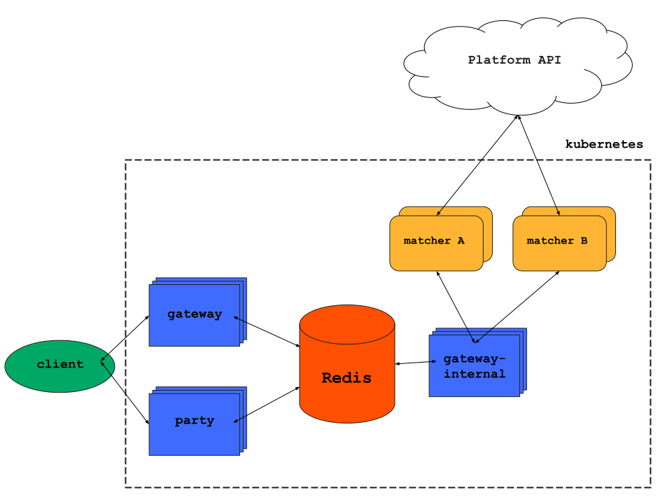

# The Gateway

This document serves as a technical overview of the Gateway: its features, its design and its implementation. It's not a usability guide; if you want to spin up your own instances of these services you should read the [Quickstart](./quickstart.md).

You should probably have some idea of [SpatialOS terminology](https://docs.improbable.io/reference/latest/shared/concepts/spatialos) before reading this document.

Only the Gateway and directly associated components are described; other components in this repository, such as PlayFab Auth or Deployment Pool Manager, are detailed in separate documents.

## What is the Gateway?

Broadly speaking, it's the component used to get your authenticated players into the correct SpatialOS deployments. It provides a scalable, asynchronous queue, and a method for distributing your custom matchmaking logic; whether that's picking the first available deployment for players or sorting them by skill level, region or whatever your game requires.

The Gateway uses a gRPC microservices architecture, and is composed of the following components:

| Component          | Purpose     |
|--------------------|-------------|
| `gateway`          | Provides the client-facing interface to the system; allows users to request to be queued and check their queue status. |
| `gateway-internal` | An internal-facing interface, used for matchmaking logic to request players from the queue and then assign them back to deployments. |
| `matcher`          | A longrunning process (rather than a gRPC service) which contains your custom matchmaking logic. We provide a library, `Base.Matcher`, which you can use to create your own matchers. You will have at least one of these per game type. |
| `party`            | Hosts two gRPC services, `party` and `invite`, which are used to manage groups of players and invitations to those groups. |
| Redis              | A [Redis](https://redis.io) instance, used to store the queue of players, join requests, and party information. |
| Platform SDK       | Improbable's Platform service; used to authenticate users and request information about running deployments. Has its own [official documentation](https://docs.improbable.io/reference/latest/platform-sdk/introduction). |

This diagram shows how the Gateway is structured:

All services and matchers are designed to be horizontally scalable. Redis is the single source of truth in the system.

## `gateway` service

The `gateway` service provides the main client-facing interface to the system as a whole. It provides a `Join` RPC, used to enqueue a party (individuals can be modelled as a party of one).

It also hosts a [`longrunning.Operations`](https://godoc.org/google.golang.org/genproto/googleapis/longrunning) service, used to check the status of a join request and delete it if no longer wanted.

## `gateway-internal` service

## `party` service

## Matchers