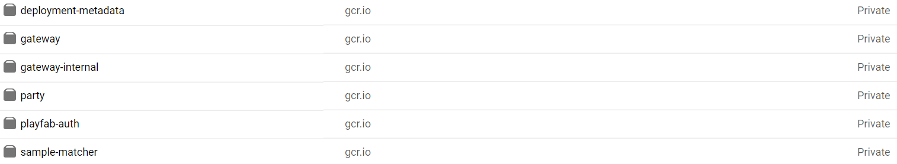
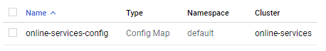

# Quickstart

This is our Quickstart guide. We'll get you up and running as quickly as we can. We're going to deploy the Gateway and PlayFab Auth services as an example, but you should be able to extend these instructions to any other included services.

## Prerequisites

Firstly, you'll need to be signed up to SpatialOS, and have it installed.

We're going to be using Google Cloud for this example. You can adapt these instructions to whatever you want - as long as it provides a [Kubernetes](https://kubernetes.io/) cluster. Don't worry if you don't know what Kubernetes is yet.

There are a few things you'll need to install.

- [Docker](https://docs.docker.com/install/) - to build the images.
- [Google Cloud SDK](https://cloud.google.com/sdk/) - we use this tool to push built images up to our Google Cloud project.
- [Terraform](https://www.terraform.io/) - we use this to configure the different cloud services we use.
- [kubectl](https://kubernetes.io/docs/tasks/tools/install-kubectl/) - used to deploy services to the cloud Kubernetes instance. It's included in Docker Desktop if you're on Windows.

You'll also need to sign up for a [PlayFab](https://playfab.com/) account if you don't have one. It's free!

## Creating a Google Cloud project

Go to the [project creation page](https://console.cloud.google.com/projectcreate) on the Google Cloud console. Give your project a name - remember, it can't be changed later!

There's a field to put in an organisation too. It's OK to leave this as `No organization` if you don't need this project to be part of one.


It might take Google a couple of minutes to create your project. Once it's ready, open the navigation menu (the hamburger in the top-left) and go to **Kubernetes Engine**.

> Kubernetes Engine is Google's hosted Kubernetes offering. What is Kubernetes (or, commonly, k8s)?  It's a **container orchestration service**. Essentially, you give it some containerized applications, and some configuration, and it ensures your application stays up.  
> 
> For example, if a given container is defined as having 3 replicas, Kubernetes will start up 3 instances of that container. If one of them falls over or is stopped, Kubernetes will immediately start up another one for you.
>
> Don't worry if this doesn't make sense yet; you'll be walked through the whole thing.

Kubernetes Engine isn't free, but you can sign up to the free trial if you need to. You'll know it's ready to go when you can see this dialog box:


It's possible to do a lot through Google Cloud's web console, but for this step we're going to use Terraform.

## Creating your infrastructure

[Terraform](https://www.terraform.io/) is a tool for configuring cloud infrastructure at a high level. It's a bit like a list of ingredients. In this case we want:

- A Kubernetes cluster.
- A MemoryStore instance (Google's hosted Redis), for the Gateway to use as a queue.

Our example configs are stored in [`/services/terraform`](../services/terraform). The files are:

- `variables.tf` - variables used for configuration, such as your Google Cloud project ID. You can define these in this configuration file, or leave them blank and provide them when you run `terraform plan` (we'll get there in a second).
- `provider.tf` - this file tells Terraform which cloud provider we're using.
- `gke.tf` - this instructs Terraform how to build our Kubernetes cluster.
- `memorystore.tf` - this defines the Google MemoryStore (Redis) instance.

You don't need to edit any files - run `terraform init` in this directory to ensure the right plugins are installed, then run `terraform plan -out "my_plan"`.

You'll be asked for some variables:
- Your cloud project ID. Note that this is the ID, not the display name.
- A zone; pick one from [here](https://cloud.google.com/compute/docs/regions-zones/), ensuring you pick a zone and not a region.
- A name for your cluster. This will be used in the name of the queue, too. You can put whatever you like here.

Terraform will print out a list of everything it's planning to configure for you, and store this as a file with whatever name you gave it earlier in place of `"my_plan"`.

You can review the plan by running `terraform show "my_plan"`.

Once you're ready to deploy, run `terraform apply "my_plan"`. This will take a few minutes. Once it's done, Terraform will print any output variables we defined in the configuration; in our case, that's the host IP of the new Redis instance.  
Make a note of it - we'll need it later. Or you can view outputs again by running `terraform output`.

If you look at your Cloud Console, you'll see we've now got a GKE cluster and a MemoryStore instance to work with. Now we just need something to run on them.

## Building your service images

We're going to use Docker to build our services as containers, then push them up to our Google Cloud project's container registry. To start, we need to configure Docker to talk to Google. Run:

```
gcloud auth configure-docker
```

You also need to ensure your `gcloud` client is authenticated properly:

```
gcloud auth login
```

Now we can build and push our images. Navigate to the directory where the Dockerfiles are kept (`/services/docker`). We're going to use the `gateway` container image as an example, but you'll want to do this for each of the images `gateway`, `gateway-internal`, `party`, `playfab-auth` and `sample-matcher`.

Build the image like this:

```bash
docker build -f ./gateway/Dockerfile -t "gcr.io/[your project id]/gateway" --build-arg CONFIG=Debug ..
```

What's happening here?
- The `-f` flag tells Docker which Dockerfile to use. A Dockerfile is like a recipe for cooking a container image. We're not going to dive into the contents of Dockerfiles in this guide, but you can read more about them in the [official documentation](https://docs.docker.com/engine/reference/builder/) if you're interested.
- The `-t` flag is used to name the image. We want to give it the name it'll have on the container store, so we use this URL-style format. We can optionally add a **tag** at the end in a `name:tag` format; if no tag is provided then `latest` will be used, which is the case here.
- The `--build-arg` is used to provide variables to the Dockerfile - in this case we're instructing `dotnet` to do a Debug rather than Release build.
- The `..` path at the end tells Docker which directory to use as the build context. We use our services root, so that the builder can access our C# service sources.

Once you've built all the images, you can push them up to the cloud. For example:

```bash
docker push "gcr.io/[your project id]/gateway"
```

Have a look at your container registry on the Cloud Console - you should see your built images there.



## Setting up Kubernetes

Kubernetes (or **k8s**) is configured using a tool called `kubectl`. Make sure you have it installed. 

Before we do anything else we need to connect to our GKE cluster. The easiest way to do this is to go to the [GKE page](https://console.cloud.google.com/kubernetes/list) on your Cloud Console and click the 'Connect' button:


This will give you a `gcloud` command you can paste into your shell and run. You can verify you're connected by running `kubectl cluster-info` - you'll see some information about the Kubernetes cluster you're now connected to.

### Config

Our k8s files are stored in `/services/k8s`. You're going to need to edit the file `config.yaml` and fill in any missing values, such as Redis host - you'll remember you can obtain the Redis host by running `terraform output` in your Terraform directory.

> We're going to use this file to create a Kubernetes **ConfigMap**. These are useful for keeping our application-specific configuration separate. ConfigMaps are used for unencrypted, non-sensitive data - for anything sensitive we use **secrets**, which we'll discuss in a bit.

Once we've filled in the information, we can push it up to our cloud GKE instance by running:

```bash
kubectl apply -f config.yaml
```

If you look at your [config page](https://console.cloud.google.com/kubernetes/config) on GKE, you'll see the newly created ConfigMap:



### Secrets

We've got two secrets we need to store on Kubernetes - our SpatialOS service account token, and our PlayFab server token.

> A secret is the k8s way of storing sensitive information such as passwords and API keys. It means the secret isn't stored in any configuration file or - even worse - your source control, but ensures your services will still have access to the information they need.

First, create a new Secret Key on PlayFab - you'll find this on the dashboard by going to Settings > Secret Keys. Give it a sensible name so you can revoke it later if you need to. Copy the long string (it's a mix of numbers and capital letters) and put it in a file called `playfab-secret.txt`. Then, run:

```bash
kubectl create secret generic "playfab-secret-key" --from-file=./playfab-secret.txt
```

You should see:

```bash
secret/playfab-secret-key created
```

Great - our secret's on Kubernetes now. We can refer to it from configuration files, and we can also be super safe and delete `playfab-secret.txt`; we don't need it any more.

We also need to create a SpatialOS service account. We provide a tool in this repo to do this for you, but first you need to make sure you're logged in to SpatialOS.

```bash
spatial auth login
```

The tool lives at `/tools/ServiceAccountCLI`. You can read more about it in its [README](../tools/ServiceAccountCLI/README.md) if you like. For now, you can navigate there and run:

```bash
dotnet run -- create --project_name "[your SpatialOS project name]" --service_account_name "online-services-demo" --refresh_token_output_file=service-account.txt --lifetime=0.0:0
```

You can change the name to whatever you want. Note that the project name is for your **SpatialOS** project, rather than the Google project ID we've used previously.

We've set the lifetime to `0.0:0` here - this just means it'll never expire. You might want to set something more appropriate to your needs.

Once the service account is generated, we push it up to k8s, like so:

```bash
kubectl create secret generic "spatialos-refresh-token" --from-file=./service-account.txt
```

### Deploying

Now we need to edit the rest of the configuration files to put in variables such as our Google project ID. This part's a little tedious, but you'll only need to do it once. Have a look through the various YAML files in the `k8s` directory and fill in anything `[in square brackets]`.

> In the real world you'll probably use a templating system such as Jinja2, or simply find-and-replace with `sed`, to do this step more easily. Kubernetes doesn't provide any templating tools out of the box so we haven't used any here; feel free to pick your favourite if you so choose.

In Kubernetes we have many different types of configuration; here we've seen `ConfigMap` and now `Deployment` and `Service`. We're not going to deep-dive into these right now; suffice to say that Deployments dictate what runs on a cluster, and Services dictate if and how they are exposed. You'll notice that `sample-matcher` doesn't have a Service configuration - this is because it doesn't expose any ports, being a long-running process rather than an actual web service.